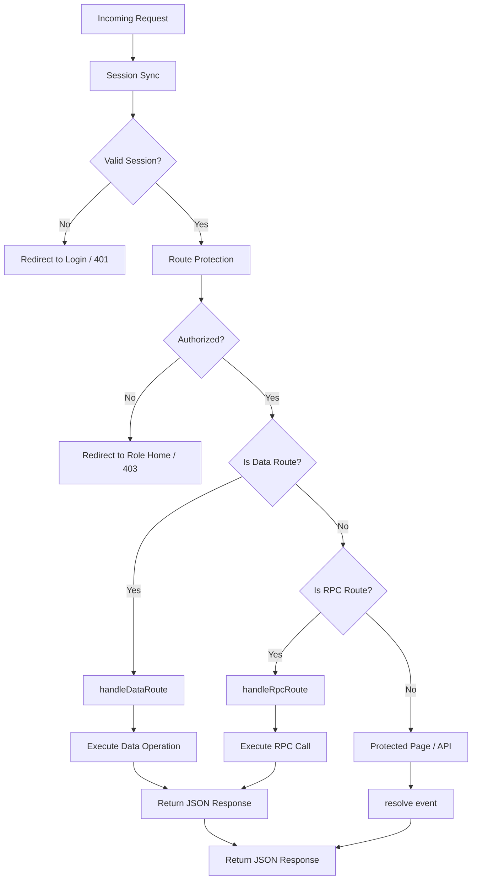

# Request Handling

## Overview

The `handle` function in `kavach.js` is the central entry point for all server requests. It orchestrates session synchronization, role-based route protection, and data/rpc endpoint handling in a unified flow.

## Architecture

### Handle Flow

```
Incoming Request
       │
       ▼
┌──────────────────┐
│ Session Sync     │ ← Parse cookies, refresh tokens if needed
└────────┬─────────┘
         │
         ▼
┌──────────────────┐
│ Route Protection │ ← Verify auth state + role-based access
└────────┬─────────┘
         │
         ▼
    ┌────┴──────┐
    │ Protected │
    │ Route?    │
    └────┬──────┘
         │
    ┌────┴────┐     ┌─────────────────┐
    │   NO    │────▶│ Public Route    │ ──▶ resolve(event)
    └─────────┘     └─────────────────┘
         │
        YES
         │
    ┌────┴─────────────────────────────────┐
    │ Is Data/RPC Route?                   │
    │ (config.dataRoute / config.rpcRoute) │
    └────┬─────────────────────────────────┘
         │
    ┌────┴────┐     ┌────────────────────┐
    │   YES   │────▶│ handleDataRoute    │ ──▶ CRUD operations
    └─────────┘     │ or                 │
                    │ handleRpcRoute     │
                    └────────────────────┘
         │
        NO
         │
         ▼
┌──────────────────┐
│  Protected Page  │ ──▶ resolve(event)
└──────────────────┘
```

### Mermaid Diagram



## Route Configuration

```typescript
interface KavachConfig {
  // Route patterns - must be explicitly configured to enable
  dataRoute?: string | string[]  // e.g., '/api/data', '/data'
  rpcRoute?: string | string[]    // e.g., '/api/rpc', '/rpc'
  
  // Protected routes (existing)
  publicRoutes?: string[]
  protectedRoutes?: string[]
  roleRoutes?: Record<string, string[]>
  
  // Role home pages
  roleHome?: Record<string, string>
}
```

### Route Matching Behavior

| Route Type | Configured? | Behavior |
|------------|-------------|----------|
| Data | Yes | Handle via `handleDataRoute` |
| Data | No | Pass through to `resolve(event)` |
| RPC | Yes | Handle via `handleRpcRoute` |
| RPC | No | Pass through to `resolve(event)` |

### Default Routes

By default, no data or RPC routes are handled. They must be explicitly configured:

```typescript
// Example configuration
const kavach = createKavach(adapter, {
  dataRoute: '/api/data',      // Enable data endpoint
  rpcRoute: '/api/rpc',        // Enable RPC endpoint
  publicRoutes: ['/login', '/'],
  protectedRoutes: ['/**']
})

## Handle Function

```typescript
export function createHandle(adapter, config) {
  return async ({ event, resolve }) => {
    // 1. Session Sync
    await sessionSync(event, adapter)
    
    // 2. Route Protection
    const protection = await protect(event, config)
    if (protection.response) return protection.response
    
    // 3. Data Endpoint Handling (only if configured)
    if (config.dataRoute && isDataRoute(event.url.pathname, config.dataRoute)) {
      return handleDataRoute(event, config)
    }
    
    // 4. RPC Endpoint Handling (only if configured)
    if (config.rpcRoute && isRpcRoute(event.url.pathname, config.rpcRoute)) {
      return handleRpcRoute(event, config)
    }
    
    // 5. Normal page/API resolution
    return resolve(event)
  }
}
```

## Data Route Handler

Handles CRUD operations via HTTP methods:

| Method | Operation |
|--------|-----------|
| GET | Read/filter data |
| POST | Create new record |
| PUT | Replace record |
| PATCH | Update record |
| DELETE | Remove record |

### Query Parameters

| Parameter | Purpose |
|-----------|---------|
| `:select` | Column selection |
| `:order` | Sorting |
| `:limit` | Pagination limit |
| `:offset` | Pagination offset |
| `:count` | Include total count |

### Response Format

```typescript
// Success
{ data: Record | Record[], count?: number }

// Error
{ error: { message: string, code?: string, status?: number } }
```

## RPC Route Handler

Invokes backend procedures with JSON payloads:

### Request

```json
{
  "procedure": "procedure_name",
  "payload": { "key": "value" }
}
```

### Response

```typescript
// Success
{ data: any }

// Error
{ error: { message: string, code?: string, status?: number } }
```

## Error Handling

All errors are sanitized before returning to clients. See `messages.ts` for consolidated error messages.

```typescript
function sanitizeError(error) {
  return {
    message: error.message || MESSAGES.ERROR_OCCURRED,
    code: error.code,
    status: error.status
  }
}
```

## Key Design Decisions

| Decision | Rationale |
|----------|-----------|
| Protection before data/rpc handling | Ensures unauthorized requests never reach data operations |
| Configurable route patterns | Allows flexibility in API URL structure |
| Sanitized errors | Prevents leaking internal details to clients |
| Unified handle function | Single entry point simplifies debugging and middleware ordering |
