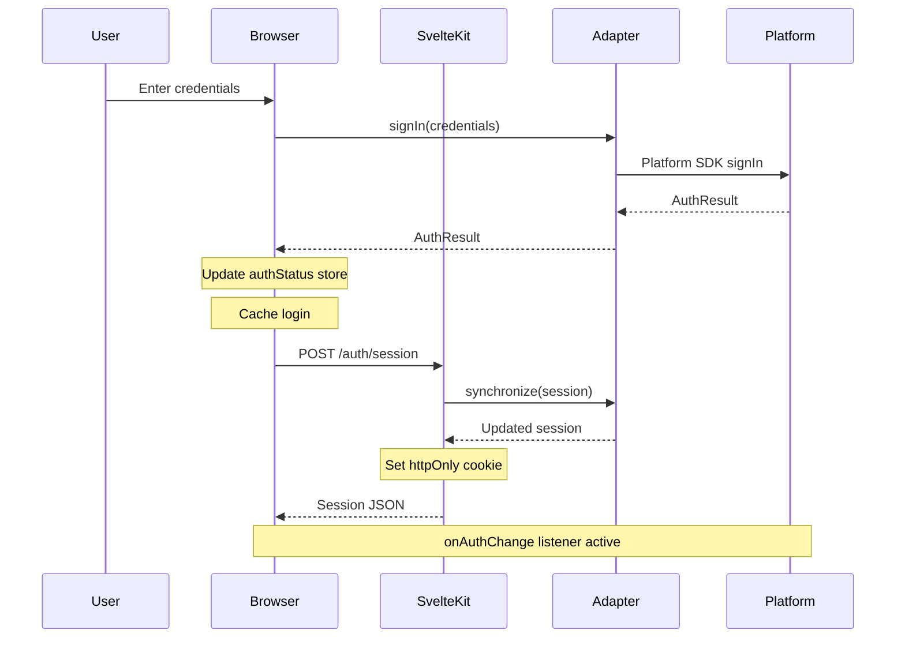
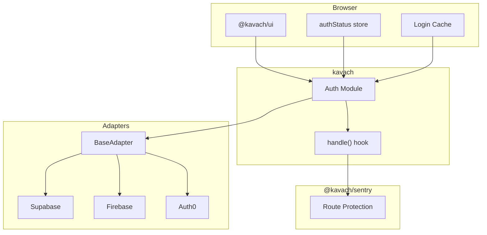

# Architecture Overview

Kavach is organized into core packages, utilities, and platform-specific adapters. The architecture separates authentication logic from platform implementations, allowing you to switch auth platforms without changing application code.

## How Auth Works

The authentication flow starts when a user enters credentials in the browser. The adapter normalizes these credentials for the specific platform SDK, handles the response, and synchronizes the session between client and server using httpOnly cookies.

## Module Interactions

The UI components interact with the core auth module, which delegates to adapters. The SvelteKit handle hook integrates with sentry for route protection on every request.

## Common Patterns

### Adapter Pattern

The adapter pattern provides a unified interface across different auth platforms. Each adapter wraps a platform-specific SDK.

**Attributes**
- `client` — The platform SDK instance
- `options` — Configuration options for the adapter

**Methods**
- `signIn(credentials)` — Authenticate user with provided credentials
- `signUp(credentials)` — Create a new user account
- `signOut()` — End the current session
- `synchronize(session)` — Refresh tokens and update session
- `onAuthChange(callback)` — Listen for auth state changes
- `parseUrlError(url)` — Extract errors from OAuth redirect URLs

**Types**
- `AuthCredentials` — Input for signIn/signUp: provider (OAuth provider name), email, password, redirectTo, scopes
- `AuthResult` — Response envelope: type (success/error/info), message, data, error
- `AuthSession` — Session data: user, access_token, refresh_token, expires_in
- `AuthUser` — User identity: id, role, email, name

**Purpose**
Allows Kavach to work with any auth platform by normalizing the interface. Applications call `kavach.signIn()` without knowing which platform is configured.

### Result Normalization

Maps platform-specific responses to a consistent format.

**Purpose**
Converts SDK-specific success/error shapes into `{ type, message, data, error }` so application code handles errors uniformly.

### Context Scoping

Creates child loggers with additional context.

**Purpose**
Enables tracing auth operations through call chains by attaching package, module, and method context to log entries.

### Zero/No-op Defaults

Provides no-op implementations for optional dependencies.

**Purpose**
Eliminates null checks in consumer code when optional features like logging are not configured.

## References

- [SvelteKit Hooks](https://svelte.dev/docs/kit/hooks)
- [PostgREST Operators](https://postgrest.org/en/stable/references/api/tables_views.html)
- [Supabase JS](https://supabase.com/docs/reference/javascript)

## Design Documents

- [01 - Core Authentication](01-auth.md)
- [02 - Sentry](02-sentry.md)
- [03 - Adapters](03-adapters.md)
- [04 - Query](04-query.md)
- [05 - UI](05-ui.md)
- [06 - Logging](06-logging.md)
- [07 - Website](07-website.md)
- [08 - Request Handling](08-handling.md)
- [09 - CLI Adapter-Aware](09-cli-adapter-aware.md)
